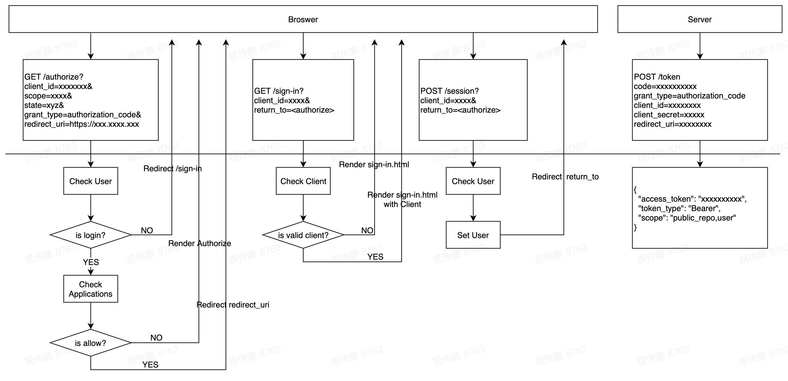

# A oauth2 server based on [node-oauth-server](!https://github.com/oauthjs/node-oauth2-server)

## Get Start

- mongodb is required
- redis is required

.env
```bash

# optional default 'root';
MYSQL_USERNAME=<MYSQL_USERNAME>
# optional default '123456';
MYSQL_PASSWORD=<MYSQL_PASSWORD> 
# optional default 'test';
MYSQL_DATABASE=<MYSQL_DATABASE> 
# optional default 3306;
MYSQL_PORT=<MYSQL_PORT> 
# optional default '127.0.0.1';
MYSQL_HOST=<MYSQL_HOST>

# optional default '127.0.0.1';
MONGO_HOST=<MONGO_HOST>
# optional default 27017;
MONGO_PORT=<MONGO_PORT>
# optional default 'test';
MONGO_DATABASE=<MONGO_DATABASE>

# optional default '127.0.0.1';
REDIS_HOST=<REDIS_HOST>
# optional default 6379;
REDIS_PORT=<REDIS_PORT>

# optional default 8080
SERVICE_PORT=<SERVICE_PORT>;
# optional default 'user-server';
APP_KEY=<APP_KEY>

# required
ADMIN_USER_ID=<ADMIN_USER_ID>
ADMIN_CLIENT_ID=<ADMIN_CLIENT_ID>
ADMIN_CLIENT_SECRET=<ADMIN_CLIENT_SECRET>
```


## Oauth2 code Steps


### Step 1 request.

```
http://localhost:8080/oauth/authorize?response_type=code&client_id=6113de587eb4554f83407345&redirect_uri=http://localhost:3000/callback&scope=admin&state=xyz
```

### Step 2 check login.

```
redirect to /sign-in?response_type=code&client_id=6113de587eb4554f83407345&redirect_uri=http://localhost:3000/callback&scope=read&state=xyz
```

### Step 3 submit username password login

```
POST /session
```

### Step 4 login success

```
redirect to http://localhost:8080/oauth/authorize?response_type=code&client_id=6113de587eb4554f83407345&redirect_uri=http://www.baidu.com&scope=read&state=xyz
```

### Step 5 application

### Step 6 redirect with code





# KOA

middleware 

- getUsers
- getUser
- postUser
- deleteUser
- putUser
- patchUser

service

- findUsers
- findUserById
- addUser
- removeUser
- updateUser
