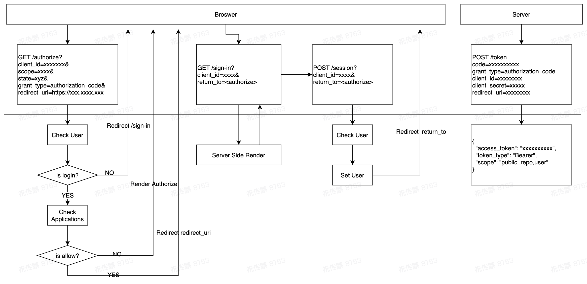

## Steps


### Step 1 request.

```
http://localhost:8080/oauth/authorize?response_type=code&client_id=6113de587eb4554f83407345&redirect_uri=http://www.baidu.com&scope=read&state=xyz
```

### Step 2 check login.

```
redirect to /sign-in?response_type=code&client_id=6113de587eb4554f83407345&redirect_uri=http://www.baidu.com&scope=read&state=xyz
```

### Step 3 submit username password login

```
POST /session
```

### Step 4 login success

```
redirect to http://localhost:8080/oauth/authorize?response_type=code&client_id=6113de587eb4554f83407345&redirect_uri=http://www.baidu.com&scope=read&state=xyz
```



